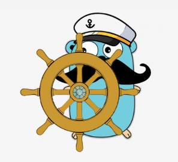

<div align="center">
  
</div>

# Captain Mustache


Dockerize your Golang applications under Captain *Mustache*. 
A fast, safe, dynamic way to create dockerfiles for you golang applications.
This CLI helps you to build Docker manifests in and dockerize your system.
With this tool you don't need to know docker to dockerize your applications, 
all you need is to have ```Go``` and ```Docker``` installed on your system.

## Table of contents

- [Install](#installation)
- [Commands](#commands)
- [Stubs](#stubs)

## Installation

Clone into the project repository and build the executable file using the following commands:

```shell
git clone https://github.com/amirhnajafiz/captain-mustache.git
make build
```

Now you can run ```captain-mustache``` command in order to use the cli.

### env path

In order to use ```captain-mustache``` in every place on your system, make sure to
the followings to either ```~/.zshrc```, ```~/.bash_profile```, or ```~/.bashrc```.

```shell
export PATH="<path-to-cloned-repository>:$PATH"
export STRAGO_PATH="<path-to-cloned-repository>"
```

## Commands

In here you can find a list of cli commands. You can run ```help``` command in order
to get a list of available commands and their usage.

|   Command    | Description                                              |
|:------------:|----------------------------------------------------------|
| ```build```  | Build dockerfile and docker compose for your application |
|   ```up```   | Start building docker containers                         |
|  ```down```  | Stop docker containers                                   |
| ```status``` | Displays a status of your containers                     |
|  ```help```  | CLI help                                                 |

## Stubs

Available stubs on captain mustache. Stubs are external services that you may have
along your Golang service. Like databases, message brokers, or email services.
Stubs will be optional when building your manifests.

|   Stub   | Description                                     | Values                                  |
|:--------:|-------------------------------------------------|-----------------------------------------|
| Database | Create database containers for your application | ```redis, mongodb, mysql, postgresql``` |
