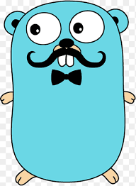

<p align="center">
    
</p>

<h1 align="center">
    Mustache
</h1>

<p align="center">
    
    
</p>

Dockerize your Golang applications under Captain *Mustache*.

A fast, safe, dynamic way to create dockerfiles for you golang applications.<br />
With this tool you don't need to know docker to dockerize your applications, all you need is to have docker installed
on your system.

## How to use?
Clone the repository:
```shell
git clone https://github.com/amirhnajafiz/mustache.git
```

Start script:
```shell
./bin/mustache
```

If you got error for executing the script, enter the following command and then try again:
```shell
chmod +x ./bin/mustache
```

## Next?
Afet that you will get a _docker_out/_ directory. Move this directory next to your golang main file where
you start your application.

Now use the following command to start the container:
```shell
./bin/mustache up
```

For stopping the container, use:
```shell
./bin/mustache down
```

## Supports
- MacOS
- Linux
